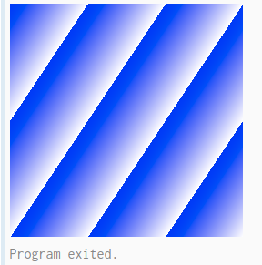
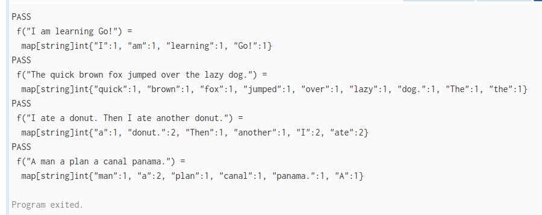
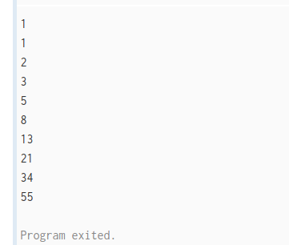
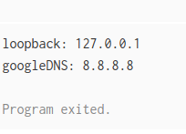
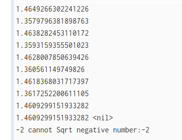
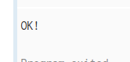
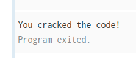
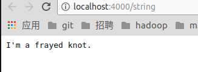
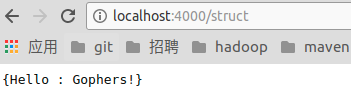
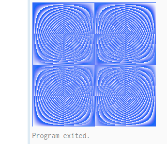

### 练习1：循环和函数
```
package main

import (
	"fmt"
	"math"
)
var z float64 = 1
func Sqrt(x float64) float64 {
	var old float64 = 0
	var dis float64 = z - old
	for dis > 0.005 || dis < -0.005 {
		old = z
		z = z - (z*z-x)/2*z
		fmt.Println(z)
		dis = z - old
	}
	return z
}

func main() {
	fmt.Println(Sqrt(2))
	fmt.Println(math.Sqrt(2))
}
```

### 练习2：slice
```
package main

import "golang.org/x/tour/pic"

func Pic(dx, dy int) [][]uint8 {
	result := make([][]uint8,dy)
	for x,_ := range result {
		result[x] = make([]uint8,dx)
		for y,_ := range result[x]{
			//intValue := (x+y)/2
			//intValue := x*y
			//intValue := x^y
			intValue := 2*x+3*y
			result[x][y] = uint8(intValue)
		}
	}
	return result
}

func main() {
	pic.Show(Pic)
}
```
#### result


### 练习3：map
```
package main

import (
	"golang.org/x/tour/wc"
	"strings"
)

func WordCount(s string) map[string]int {
	result := make(map[string]int)
	stringList := strings.Fields(s)
	for _,value := range stringList {
		v,flag :=  result[value]
		if flag {
			result[value] = v+1
		} else {
			result[value] = 1
		}
	}
	return result
}

func main() {
	wc.Test(WordCount)
}
```
#### result


### 练习4 斐波那契闭包
```
package main

import "fmt"

// fibonacci 函数会返回一个返回 int 的函数。
func fibonacci() func() int {
	i := 0
	j := 1
	return func() int {
		result := i+j
		i = j
		j = result
		return i
	}
}

func main() {
	f := fibonacci()
	for i := 0; i < 10; i++ {
		fmt.Println(f())
	}
}
```
#### result


### 练习5 Stringers
```
package main

import "fmt"

type IPAddr [4]byte

// TODO: Add a "String() string" method to IPAddr.

func (ip IPAddr) String() string {
	return fmt.Sprintf("%d.%d.%d.%d",ip[0],ip[1],ip[2],ip[3])
}

func main() {
	addrs := map[string]IPAddr{
		"loopback":  {127, 0, 0, 1},
		"googleDNS": {8, 8, 8, 8},
	}
	for n, a := range addrs {
		fmt.Printf("%v: %v\n", n, a)
	}
}
```
#### resutl


### 练习6 错误
```
package main

import (
	"fmt"
)

type ErrNegativeSqrt float64

var z float64 = 1

func (e ErrNegativeSqrt) Error() string {
	return fmt.Sprint("cannot Sqrt negative number:",float64(e))
}

func Sqrt(x float64) (float64, error) {
	if x < 0 {
		var err ErrNegativeSqrt = ErrNegativeSqrt(x)
		return x, err
	}
	var old float64 = 0
	var dis float64 = z - old
	for dis > 0.1 || dis < -0.1 {
		old = z
		z = z - (z*z-x)/2*z
		fmt.Println(z)
		dis = z - old
	}
	return z, nil
}

func main() {
	fmt.Println(Sqrt(2))
	fmt.Println(Sqrt(-2))
}
```
#### result


### 练习7 Reader
```
package main

import "golang.org/x/tour/reader"

type MyReader struct{}

// TODO: Add a Read([]byte) (int, error) method to MyReader.
func (v MyReader) Read(b []byte) (int, error) {
	for index,_ := range b {
		b[index] = 65
	}
	return len(b), nil
}

func main() {
	reader.Validate(MyReader{})
}
```
#### result


### 练习8 rot13Reader
```
package main

import (
	"io"
	"os"
	"strings"
)

type rot13Reader struct {
	r io.Reader
}

func (rot rot13Reader) Read(b []byte) (int, error) {
	r := rot.r
	n, err := r.Read(b)
	for index, _ := range b {
		if 65 <= b[index] && b[index] <= 90 {
			b[index] = (b[index] - 65 + 13) % 26 + 65
		}
		if 97 <= b[index] && b[index] <= 122 {
			b[index] = (b[index] - 97 + 13) % 26 + 97
		}
	}
	return n, err
}

func main() {
	s := strings.NewReader("Lbh penpxrq gur pbqr!")
	r := rot13Reader{s}
	io.Copy(os.Stdout, &r)
}
```
#### result


### 练习9 http处理
[代码](../http/exercise-http-handlers.go)
#### result
   


### 练习10 图片
```
package main

import "golang.org/x/tour/pic"
import "image/color"
import "image"

type Image struct{}

func (img Image) ColorModel() color.Model {
	return color.RGBAModel
}

func (img Image) Bounds() image.Rectangle {
	return image.Rect(0, 0, 255, 255)
}

func (img Image) At(x, y int) color.Color {
	//v := (x+y)/2
	v := x*y
	//v := x^y
	//v := 2*x + 3*y
	return color.RGBA{uint8(v), uint8(v), 255, 255}
}

func main() {
	m := Image{}
	pic.ShowImage(m)
}
```
#### result

